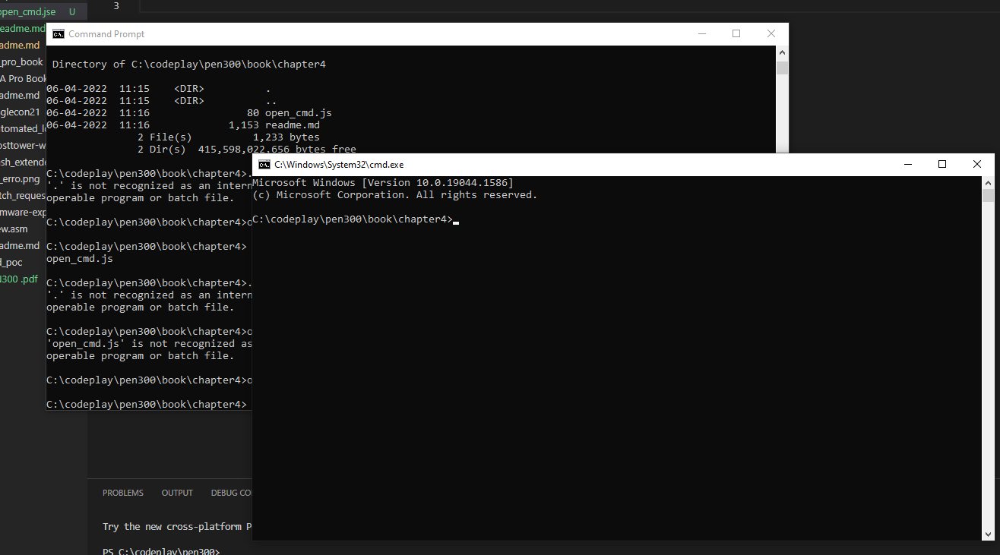

# chapter 4 client side code execution with windows script host

Jscript is a dialect of JavaScript developed and owned by Microsoft that is used in Internet 
Explorer. It can also be executed outside the browser through the Windows Script Host,
197 which 
can execute scripts in a variety of languages

in order to check execution we can see default application by file type.

### Execution of jscript on windows

Js script can be directly executed onwindows thats why they are important

As mentioned previously, executing Jscript outside the context of a web browser bypasses all 
security settings. This allows us to interact with the older ActiveX198 technology and the Windows 
Script Host engine itself. Let’s discuss what we can do with this combination.

As shown in the code in Listing 116, we can leverage ActiveX by invoking the ActiveXObject199
constructor by supplying the name of the object. We can then use WScript.Shell to interact with 
the Windows Script Host Shell to execute external Windows applications. For example, we can 
instantiate a Shell object named “shell” from the WScript.Shell class through the ActiveXObject
constructor to run cmd.exe through the Run command

Checking on windows 10 the extension  is jse



### Exercises

1. Create a simple Jscript file that opens an application.

made at: open_application.jse

2. Look through the list of default applications related to file types. Are there any other 
interesting file types we could leverage?

- .msc
- .perl
- .VBE
- .vbs
- .WSF
- .WSH

3. The .vbs extension is also linked to the Windows Script Host format. Write a simple VBScript 
file to open an application

made at: open_chrome.vbs

### Jscript Meterpreter Dropper

creating a dropper to inject the payload into.

dropper.jse works but is detected as malicious.

### starting samba in kali


### using C#

hellow eworld works

```
Hello World!

C:\Users\HP\source\repos\JscriptHelloWorld\bin\Debug\net5.0\JscriptHelloWorld.exe (process 7148) exited with code 0.
To automatically close the console when debugging stops, enable Tools->Options->Debugging->Automatically close the console when debugging stops.
Press any key to close this window . . .

```

## Using DotNetToJsScript
using https://github.com/tyranid/DotNetToJScript


